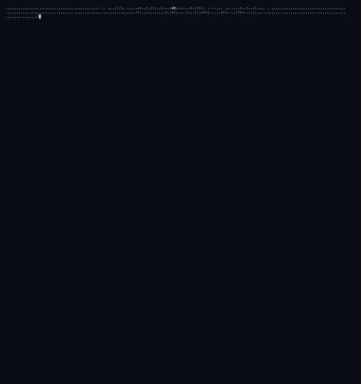

  

  
  
  
  
  

<h3 align="center">AI Developer & Python Engineer | Backend Developer</h3>

---

<h2 align="center">👨‍💻 About me</h2>

<table width="100%" style="border: none; background-color: transparent;">
<tr>
<td width="60%" align="left" valign="middle" style="border: none;">

✨ Hello There! I'm **Rayan**, an AI Developer & Software Engineering student. 🌟 I enjoy building intelligent systems, solving algorithmic problems, and working on backend architectures. 💫

 

⭐ Studying Software Engineering & AI  
✨ Active in Competitive Programming & Development  
🌟 Building real-world web, mobile & AI applications  

</td>
<td width="40%" align="center" valign="middle" style="border: none;">

</td>
</tr>
</table>

---

## ⚙️ Tech Stack & Technologies

  
  
  
  
  
  
  
  
  
  
  

---

---

<!-- ═══════════════════════════════════════════════════════════════════════════ -->
<!-- 🏆 ACHIEVEMENTS SECTION                                                   -->
<!-- ═══════════════════════════════════════════════════════════════════════════ -->

  

  <!-- GitHub Trophies -->
  

 

 

---
<!-- 💻 LANGUAGES -->
<h4>💻 Languages & Core</h4>

  
  
  
  
  
  
  
  
  
  
  
  
  

<!-- 📱 MOBILE DEVELOPMENT -->
<h4>📱 Mobile Development</h4>

  
  
  

<!-- 🤖 AI & MACHINE LEARNING -->
<h4>🤖 AI & Machine Learning</h4>

  
  
  
  

<!-- 🌐 WEB DEVELOPMENT -->
<h4>🌐 Web Development</h4>

  
  
  
  
  
  
  
  
  

<!-- 🗄️ DATABASES -->
<h4>🗄️ Databases</h4>

  
  
  
  
  
  

<!-- 🔧 TOOLS & PLATFORMS -->
<h4>🔧 Tools & Platforms</h4>

  
  
  
  
  
  
  
  

 

<!-- ═══════════════════════════════════════════════════════════════════════════ -->
<!-- 🎮 CONTRIBUTION SHOWCASE                                                    -->
<!-- ═══════════════════════════════════════════════════════════════════════════ -->

  

  
  <!-- Pac-Man Contribution Graph -->
  <picture>
    <source media="(prefers-color-scheme: dark)" srcset="./assets/pacman-contribution-graph-dark.svg"/>
    <source media="(prefers-color-scheme: light)" srcset="./assets/pacman-contribution-graph.svg"/>
    
  </picture>
  
   
  
  👾 Watch Pac-Man devour my contributions!
  

 

 

<!-- ═══════════════════════════════════════════════════════════════════════════ -->
<!-- 🌟 FOOTER                                                                   -->
<!-- ═══════════════════════════════════════════════════════════════════════════ -->

  
  
  
   
  
  <!-- ☕ BUY ME A COFFEE -->
  
  
    
  
  
  

<!-- ═══════════════════════════════════════════════════════════════════════════ -->
<!-- 📝 END OF README                                                            -->
<!-- ═══════════════════════════════════════════════════════════════════════════ -->
