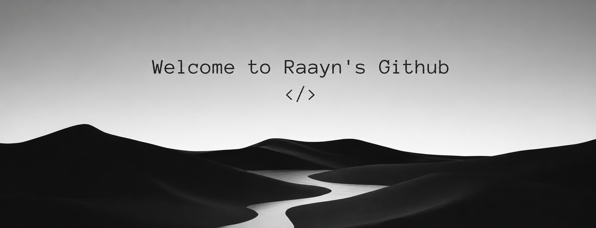

<p align="center">
  
</p>

<h1 align="center">Hi 👋, I'm Benjamin</h1>

<h3 align="center">Computer Engineering Student | Backend Developer</h3>

<p align="center">
  Building reliable backend systems with clean architecture,
  scalable solutions, and production-ready code.
</p>

---

## 🚀 About Me

Hey, I'm **Benjamin** 👋

I'm a **Computer Engineering student** focused on backend development
and building real-world systems.

I enjoy building scalable applications and understanding
how backend systems work behind the scenes.

### 🧠 Currently Learning

- 🐍 Python
- ⚡ FastAPI
- 🐘 PostgreSQL
- 🦀 SQLAlchemy
- 🐳 Docker
- 🔴 Redis
- 🧠 Data Structures & Algorithms

### 🎯 My Goal

Write clean code.

Build reliable software.

Understand real-world systems.

And grow into a software engineer who creates
systems that actually last.

---

## 🤝 Connect

<p align="center">

<a href="https://github.com/">
  
</a>

</p>

---

## 💻 Tech Stack

### Languages

<p>
  
</p>

### Backend

<p>
  
</p>

### Databases

<p>
  
</p>

### DevOps & Tools

<p>
  
</p>

---

## 📊 GitHub Stats

<p align="center">
  
</p>

<p align="center">
  
</p>

---

## 🧠 Most Used Languages

<p align="center">
  
</p>

---

## 📈 Activity Graph

<p align="center">
  
</p>

---

## 👀 Profile Views

<p align="center">
  
</p>

---

```text
while(alive) {
    code();
    learn();
    build();
    repeat();
}
